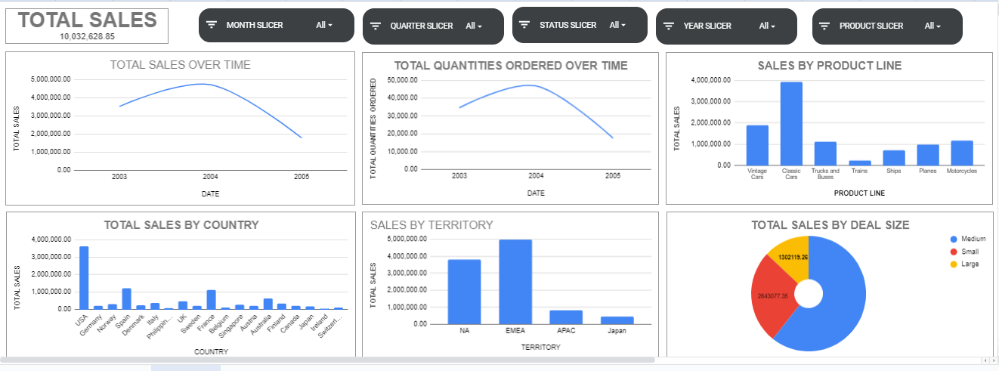

# Google Sheets Sales Dashboard

## Introduction
This project involved the creation of a dynamic sales performance dashboard using Google Sheets. The dashboard provides insights into sales trends over time, product demand, regional performance, and deal size distribution. Using various visualizations and interactive slicers, the dashboard allows users to drill down into the data and analyze specific periods, product lines, and sales dimensions to make informed decisions.

## Overview
The dataset used in this dashboard consists of sales data across different regions, product lines, and deal sizes over several years. The dashboard was designed to offer a user-friendly interface with multiple charts and slicers, enabling users to explore the data from different perspectives. Key metrics like total sales and total quantities ordered were visualized over time, while breakdowns by product line, country, territory, and deal size provided granular insights into sales distribution.

The primary visualizations included:
- **Scorecard for Total Sales** to display overall revenue.
- **Line charts** for total sales and quantities ordered over time.
- **Bar charts** for sales by product line, country, and territory.
- **Pie chart** for total sales by deal size.
- Slicers for filtering data by month, quarter, status, year, and product, enhancing interactivity and allowing users to explore various dimensions within the dataset.

## Findings
1. **Total Sales Overview**: The total sales amounted to $10,032,628.85, signifying a healthy revenue figure across the data period.

2. **Sales and Quantities Ordered Over Time**: Both total sales and quantities ordered peaked between 2003 and 2004, followed by a decline in 2005. This suggests fluctuations in demand and sales volume, potentially due to market conditions or product lifecycle issues.

3. **Product Line Performance**: The **Classic Cars** category emerged as the top-selling product line, followed by **Vintage Cars** and **Motorcycles**. Product lines such as **Ships** and **Planes** had lower sales, indicating lesser demand in these categories.

4. **Country-wise Sales**: The **USA** dominated in terms of sales, followed by **Germany** and **France**. Other countries like **Canada** and **Japan** generated significantly lower sales, indicating potential for market growth.

5. **Regional Sales**: The **EMEA** and **North America (NA)** regions accounted for the majority of sales, with **APAC** and **Japan** contributing less, suggesting untapped market potential.

6. **Deal Size Distribution**: Medium deals accounted for the majority of sales, while large deals contributed the least, highlighting the importance of medium transactions to overall revenue.

## Recommendations
1. **Optimize High-Performing Product Lines**: With **Classic Cars** and **Vintage Cars** generating the highest revenue, further investment in these categories—through targeted marketing, expanded product offerings, and enhanced customer engagement—could bolster overall sales performance.

2. **Investigate Sales Decline**: The decline in sales and quantities ordered over time warrants an investigation into external factors, such as economic changes or shifts in market demand, to inform strategic adjustments and prevent future downturns.

3. **Expand in Underperforming Regions**: Markets like **Japan**, **Canada**, and **Australia** present an opportunity for growth. Implementing region-specific strategies such as tailored marketing campaigns or improving distribution channels could help increase sales in these countries.

4. **Focus on medium Deal Clients**: Given that medium deals constitute a significant portion of total sales, fostering deeper relationships with medium clients through loyalty programs, exclusive offers, or dedicated account management could further enhance revenue.

5. **Tap Into the APAC and Japan Markets**: The relatively low sales from **APAC** and **Japan** suggest an opportunity for expansion. Strategic initiatives to penetrate these regions, such as localized marketing efforts or strategic partnerships, could help balance the sales distribution globally.